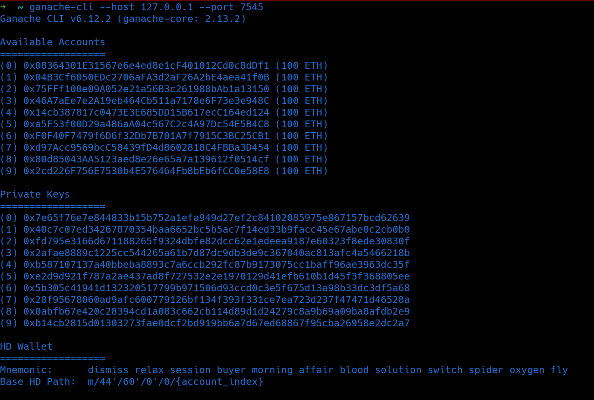

# O'zbek tilida
# 🗳️ Blockchain Ovoz Berish Tizimi (Flask + Solidity)

Bu loyiha Flask va Solidity yordamida qurilgan, foydalanuvchilar Ethereum blockchain asosida xavfsiz ovoz berishda ishtirok etishlari mumkin bo‘lgan tizimdir. Har bir saylov alohida `Voting.sol` kontrakti sifatida blockchain'ga joylanadi.

---

## ✨ Asosiy imkoniyatlar

- Har bir saylov uchun alohida `Voting.sol` smart-kontrakt deploy qilinadi
- Nomzodlar faqat saylov boshlanishidan oldin qo‘shilishi mumkin
- Har foydalanuvchi faqat bir marta ovoz bera oladi
- Ovozlar Ethereum blockchain'da saqlanadi
- Saylov natijalari  jadval ko‘rinishida ko‘rsatiladi
- Natijalarni CSV holatda yuklab olish mumkin
- Admin panel orqali foydalanuvchilar va saylovlar boshqariladi

---

## 🧱 Texnologiyalar

- `Python 3.10+`
- `Flask`
- `Solidity`
- `Web3.py`
- `Ganache CLI`
- `Bootstrap 5 + Chart.js`
- `SQLite`

---

## ⚙️ O‘rnatish

### 1. Repository’ni klon qilish

```bash
git clone https://github.com/MuxammadiyevG/ChainVoting.git
cd ChainVoting
```

```bash 
python3 -m venv .venv
pip install -r requirements.txt
```
## Blockchain blocklarini saqlash uchun Ganache test tarmog'idan foydalanamiz .

## Ganacheni o'rnatish
```bash
- 'Arch linux' `yay -S ganache-cli`
- boshqa dirstolarda (Windows , va hk ) 
```
```bash 
npm install -g ganache-cli 
```

## Ganacheni ishga tushirish
```bash
ganache-cli --host 127.0.0.1 --port 7545 
```


### Ixtiyoriy kalit juftligini olib .env ga joylaysiz

```python
BLOCKCHAIN_PROVIDER=http://127.0.0.1:7545
ADMIN_ADDRESS=0xyour_address
ADMIN_PRIVATE_KEY=0xyour_private_key
```

# Ganachega backendimizni bog'lash uchun Voting.solni compilatsiya qilamiz. 

```bash
python3 contracts/compile.py
```

## Shuning bilan dastur ishga tushirilishga tayyor 

```bash
python3 app.py
```

# Ingliz tilida 


# 🗳️ Blockchain Voting System (Flask + Solidity)

A secure and decentralized voting system built with Flask and Solidity, allowing users to participate in blockchain-based elections. Each election is deployed as a separate smart contract on the Ethereum blockchain for transparency and integrity.

---

## ✨ Features

✅ Deploys a unique `Voting.sol` smart contract for every election  
✅ Candidates can only be added before the election starts  
✅ One vote per user guarantee  
✅ All votes are securely stored on the Ethereum blockchain  
✅ Live election results in table format  
✅ Export results as CSV  
✅ Admin panel for managing users and elections

---

## 🧱 Tech Stack

- Python 3.10+
- Flask
- Solidity
- Web3.py
- Ganache CLI (local Ethereum test network)
- Bootstrap 5 + Chart.js (Frontend)
- SQLite (Database)

---

## ⚙️ Installation & Setup

### 1️⃣ Clone the Repository
```bash
git clone https://github.com/MuxammadiyevG/ChainVoting.git
cd ChainVoting
```

### 2️⃣ Setup Virtual Environment & Install Dependencies
```bash
python3 -m venv .venv
source .venv/bin/activate  # Linux / macOS
# OR
.venv\Scripts\activate     # Windows

pip install -r requirements.txt
```

### 3️⃣ Run Ganache Local Blockchain

#### Install Ganache CLI
```bash
# Arch Linux
yay -S ganache-cli

# Other Systems (Windows, Mac, Ubuntu)
npm install -g ganache-cli
```

#### Start Ganache Test Network
```bash
ganache-cli --host 127.0.0.1 --port 7545
```

---

## 🔑 Environment Configuration

Create a `.env` file in the project root with your settings:
```env
BLOCKCHAIN_PROVIDER=http://127.0.0.1:7545
ADMIN_ADDRESS=0xyour_address
ADMIN_PRIVATE_KEY=0xyour_private_key
```

Replace `0xyour_address` and `0xyour_private_key` with values from Ganache accounts.

---

## 🛠️ Compile Smart Contract

Compile the Solidity smart contract to generate ABI & Bytecode:
```bash
python3 contracts/compile.py
```

---

## 🚀 Run the Application
```bash
python3 app.py
```

Visit: [http://127.0.0.1:5000](http://127.0.0.1:5000) to access the application.

---

## 📊 Example Screenshot


